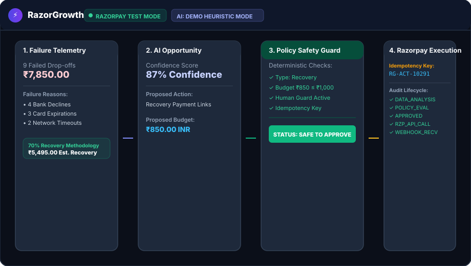
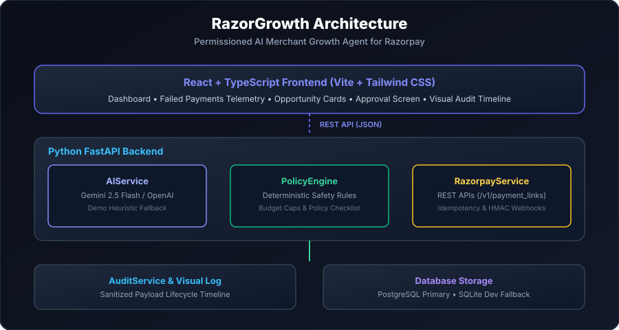

# RazorGrowth ⚡

> **Permissioned AI Merchant-Growth Agent for the Razorpay AI Buildathon 2026**  
> *Recovering lost merchant payment revenue with deterministic policy safety, explicit human-in-the-loop approval, idempotent Razorpay execution, and complete visual auditability.*

🔗 **Repo**: [github.com/varun-sharma-2006/Razorgrowth](https://github.com/varun-sharma-2006/Razorgrowth) | 📜 **License**: [MIT License](LICENSE)  
👤 **Author**: Built solo by [Varun Sharma](https://github.com/varun-sharma-2006) for the Razorpay AI Buildathon 2026.

---

## 🎬 Demo



*AI detects a failed-payment recovery opportunity → Policy Engine validates budget against merchant safety cap → Merchant explicitly approves → Razorpay executes with idempotency guard → Audit timeline updates in real time.*

---

## 📊 Market Context

In India's fast-growing digital commerce ecosystem, payment drop-off rates typically range from **5% to 15%** depending on payment method (UPI, cards, netbanking) and issuing bank downtime. For high-volume merchants, unmonitored failed payments represent a significant drain on recoverable top-line revenue.

Traditional analytics dashboards leave merchants with static reports, forcing manual intervention to diagnose failures, select eligible high-intent customers, and issue recovery payment links.

**RazorGrowth** bridges this gap by introducing an AI agent that continuously monitors payment telemetry, identifies high-intent recovery opportunities, and prepares structured recovery campaigns—**without ever holding unrestricted financial authority**.

```
  Failed Payment Drop-off          AI Opportunity Scan           Policy Safety Check           Human Approval           Razorpay REST Execution
┌─────────────────────────┐     ┌───────────────────────┐     ┌─────────────────────┐     ┌────────────────────┐     ┌────────────────────────┐
│ 9 Failures (₹7,850.00)  │ ──► │ Evidence & Factors    │ ──► │ Budget Cap ≤ ₹1,000 │ ──► │ Merchant Review &  │ ──► │ Recovery Payment Link  │
│ Bank drop / Card expire │     │ 87% Confidence Score  │     │ Action Type Allowed │     │ Explicit Approval  │     │ Idempotency Key Guard  │
└─────────────────────────┘     └───────────────────────┘     └─────────────────────┘     └────────────────────┘     └────────────────────────┘
```

---

## 📌 Core Architectural Principles

1. **Controlled Autonomy Over Unrestricted Authority**:
   - The LLM reasons, identifies opportunities, and generates recommendations.
   - Deterministic backend code enforces financial limits and executes API calls.
   - The merchant retains explicit approval authority before any money or payment link is generated.

2. **Deterministic Safety Policy Engine**:
   - Validates every proposal against merchant policy limits (e.g., maximum ₹1,000 budget cap).
   - Rejects out-of-bounds proposals before human approval or API execution occurs.
   - Generates an explicit **"Why Was This Action Allowed?" Checklist**:
     - `[✓] Action type allowed (failed_payment_recovery)`
     - `[✓] Proposed Budget ₹850.00 ≤ Merchant Cap ₹1,000.00`
     - `[✓] Human Approval Guard active`
     - `[✓] Action Idempotency Key generated (RG-ACT-XXXXX)`
     - `STATUS: SAFE TO APPROVE`

3. **Fault-Tolerant Idempotent Execution**:
   - Assigns a unique `idempotency_key` (e.g., `RG-ACT-10291`) to every proposed action.
   - Network retries reuse the identical idempotency key (`X-Razorpay-Idempotency-Key`) to guarantee zero duplicate financial transactions.

4. **Transparent Audit Trail**:
   - Visual step-by-step lifecycle log (`DATA_ANALYSIS` → `PATTERN_DETECTION` → `POLICY_EVALUATION` → `MERCHANT_APPROVAL` → `RAZORPAY_API_CALL` → `WEBHOOK_RECEIVED`).
   - Includes expandable sanitized JSON payloads for full auditability.

---

## 🏗️ System Architecture



<details>
<summary>🔍 View Text / ASCII Architecture Diagram</summary>

```
                    RAZORGROWTH
                         │
                         ▼
             React + TypeScript UI
                         │
                    REST / HTTP
                         │
                         ▼
                 FastAPI Backend
                         │
       ┌─────────────────┼─────────────────┐
       │                 │                 │
       ▼                 ▼                 ▼
  AI Service       Policy Engine      Razorpay Service
(Gemini/OpenAI/  (Deterministic      (REST APIs, Webhooks,
 Heuristic Mode)  Safety Rules)      Razorpay Test Mode)
       │                 │                 │
       └────────┬────────┘                 ▼
                │             Razorpay Sandbox / Test
                ▼
        Action / Approval
                │
                ▼
          Audit Service
                │
                ▼
PostgreSQL Database (SQLite fallback ready)
```

</details>

---

## ✨ Key Features

- **AI-Powered Revenue Recovery**: Scans transaction logs, evaluates customer purchase history, and calculates explainable recovery estimates:
  $$\text{Estimated Recoverable} = \text{Failed Payments Loss (\text{₹}7,850.00)} \times 70\% \text{ Conversion Rate} = \text{₹}5,495.00$$
- **Dual Execution Modes**: Supports live **Razorpay Test Mode** APIs (`KEY_ID` & `KEY_SECRET`) and a zero-credential **Local Demo Adapter** mode so judges can evaluate the app instantly out-of-the-box.
- **HMAC SHA256 Webhook Verification**: Signature verification (`X-Razorpay-Signature`) for asynchronous `order.paid` and `payment.failed` webhook events.
- **Judges' Live Failure Control Room**:
  - **Demo 1 (Safety Policy Limit Block)**: AI proposes ₹3,000 budget against ₹1,000 cap → Policy Engine immediately BLOCKS the action.
  - **Demo 2 (Razorpay API Timeout & Safe Halt)**: Simulates gateway 504 timeout → Retries with identical idempotency key → Engages `SAFE HALT` with zero duplicate charges.

---

## 🛠️ Tech Stack

- **Frontend**: React 18, TypeScript, Vite, Tailwind CSS, Lucide Icons, Axios.
- **Backend**: Python 3.13, FastAPI, Pydantic V2, Async SQLAlchemy.
- **Database**: PostgreSQL (Primary) / SQLite Async (Development & Demo).
- **AI Integration**: Modular `AIService` supporting Gemini 2.5 Flash, OpenAI GPT-4o-mini, or zero-config Demo Heuristic Mode.
- **Payment API**: Razorpay REST API (`/v1/payment_links`), HMAC SHA256 Webhook verification, Razorpay Test Mode & Local Demo Adapter.

---

## 🚀 Quick Start Guide

### Prerequisites
- Python 3.10+
- Node.js 18+ & npm

### 1. Backend Setup

```bash
cd backend

# Create virtual environment
python -m venv venv
# On Windows:
venv\Scripts\activate
# On Linux/macOS:
source venv/bin/activate

# Install dependencies
pip install -r requirements.txt

# Create environment file from template
cp .env.example .env

# Start FastAPI server (auto-seeds database with 9 failed payments totaling ₹7,850)
python -m uvicorn app.main:app --reload --port 8000
```
- Server URL: `http://localhost:8000`
- Interactive API Docs: `http://localhost:8000/docs`

### 2. Frontend Setup

In a second terminal:

```bash
cd frontend

# Install dependencies
npm.cmd install

# Start Vite dev server
npm.cmd run dev
```
- Application Dashboard: `http://localhost:5173`

---

## 🧪 Running Automated Unit Tests

The backend includes **11 focused unit test functions** covering all critical subsystems:

```bash
cd backend
python -m pytest tests/test_backend.py -v
```

### Verified Test Suite
- `test_health_status_endpoint`: API health & integration status
- `test_merchant_metrics_calculation`: Metrics calculation (₹7,850 loss, ₹5,495 recoverable)
- `test_ai_opportunity_generation`: AI telemetry scan & confidence score evaluation
- `test_policy_engine_allowed_budget`: Validates proposed ₹850 <= ₹1,000 passes safety check
- `test_policy_engine_blocked_budget`: Validates proposed ₹3,000 > ₹1,000 is blocked by Policy Engine
- `test_merchant_approval_flow`: End-to-end human approval & Razorpay API execution
- `test_merchant_rejection_flow`: Explicit proposal rejection handling
- `test_action_idempotency_key_uniqueness`: Idempotency key uniqueness per action
- `test_api_timeout_and_retry_safe_halt`: API timeout simulation & safe halt verification
- `test_razorpay_webhook_signature_verification`: Webhook HMAC SHA256 signature verification
- `test_audit_event_sanitized_logging`: Audit log creation & payload sanitization

---

## 🌐 Deployment Guide

### Deploying Backend (Render / Railway)
1. Connect your GitHub repository to [Render](https://render.com).
2. Root Directory: `backend`
3. Build Command: `pip install -r requirements.txt`
4. Start Command: `uvicorn app.main:app --host 0.0.0.0 --port $PORT`

### Deploying Frontend (Vercel / Netlify)
1. Connect repository to [Vercel](https://vercel.com).
2. Root Directory: `frontend`
3. Build Command: `npm run build`
4. Output Directory: `dist`

---

## 📂 Project Directory Structure

```
genraz/
├── backend/
│   ├── app/
│   │   ├── main.py              # FastAPI application entrypoint & lifespan
│   │   ├── config.py            # Pydantic settings & environment config
│   │   ├── database.py          # SQLAlchemy async database engine
│   │   ├── models.py            # 7 SQLAlchemy entities
│   │   ├── schemas.py           # Pydantic request/response schemas
│   │   ├── seed.py              # Database seeder (10 customers, 9 failed payments)
│   │   ├── services/
│   │   │   ├── ai_service.py        # LLM Reasoning & Heuristic Fallback
│   │   │   ├── policy_engine.py     # Deterministic Safety Rules & Policy Checklist
│   │   │   ├── razorpay_service.py  # Razorpay REST client & Webhook HMAC Verification
│   │   │   └── audit_service.py     # Sanitized Audit Logger
│   │   └── routers/
│   │       ├── merchant.py          # Metrics & settings endpoints
│   │       ├── payments.py          # Payment & customer telemetry
│   │       ├── opportunities.py     # AI Scan & proposal generation
│   │       ├── actions.py           # Merchant approval state machine
│   │       ├── webhooks.py          # Razorpay webhook listener
│   │       ├── simulation.py        # Demo Control Room endpoints
│   │       └── audit.py             # Audit timeline endpoint
│   ├── tests/
│   │   └── test_backend.py      # 11 unit test suite
│   ├── requirements.txt
│   └── .env.example
├── frontend/
│   ├── src/
│   │   ├── components/
│   │   │   ├── Navbar.tsx                # Status badges & header
│   │   │   ├── MetricsOverview.tsx       # KPI cards & methodology explanation
│   │   │   ├── FailedPaymentsList.tsx    # Payment failure telemetry table
│   │   │   ├── OpportunityCard.tsx       # AI recommendation card
│   │   │   ├── ApprovalModal.tsx         # Human approval screen & Policy Checklist
│   │   │   ├── AuditTimeline.tsx         # Visual audit trail & timeline
│   │   │   └── FailureSimulationPanel.tsx# Judges' demo control room
│   │   ├── services/
│   │   │   └── api.ts                    # Axios API client
│   │   ├── types/                        # TypeScript interfaces
│   │   ├── App.tsx                       # Main dashboard view
│   │   └── index.css                     # Tailwind CSS & custom styling
│   ├── package.json
│   └── vite.config.ts
├── docs/
│   ├── architecture.svg         # Crisp SVG architecture diagram
│   └── demo.gif                 # Animated UI demonstration placeholder
├── README.md
└── LICENSE                      # MIT License
```

---

## 📜 License

Distributed under the [MIT License](LICENSE). Built solo by **Varun Sharma** for the **Razorpay AI Buildathon 2026**.
