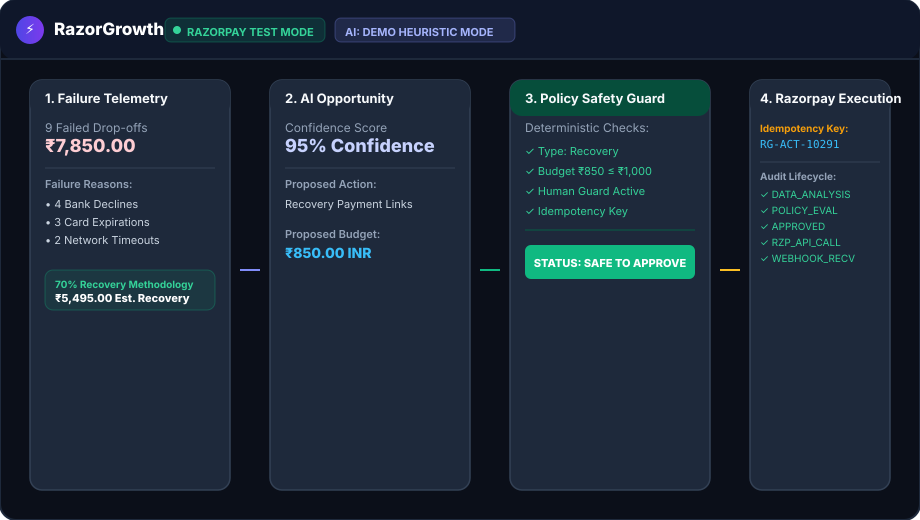
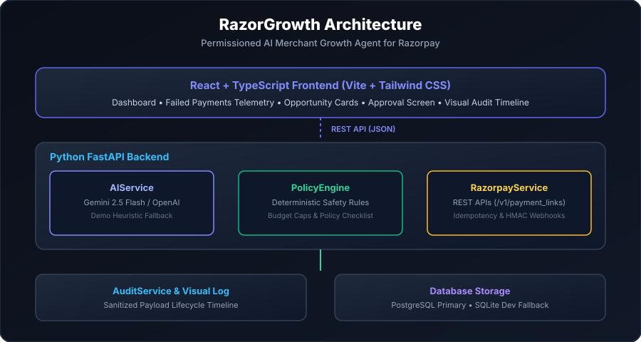

# RazorGrowth ⚡

> **Permissioned AI Merchant-Growth Agent for the Razorpay AI Buildathon 2026**  
> *Recovering lost merchant payment revenue with deterministic policy safety, explicit human-in-the-loop approval, idempotent Razorpay execution, and complete visual auditability.*

🔗 **Repo**: [github.com/varun-sharma-2006/Razorgrowth](https://github.com/varun-sharma-2006/Razorgrowth) | 📜 **License**: [MIT License](LICENSE)  
👥 **Team**: Built by [Varun Sharma](https://github.com/varun-sharma-2006) and [Yashika Garg](https://github.com/yashikagarg16) for the Razorpay AI Buildathon 2026.

---

## 🎬 Demo



*AI detects a failed-payment recovery opportunity → Policy Engine validates the incentive budget against the merchant safety cap → Merchant explicitly approves → Razorpay sends one recovery Payment Link per customer, deduplicated by `reference_id` → Signed webhooks mark payments recovered → Audit timeline updates live.*

---

## 📊 Market Context

In India's fast-growing digital commerce ecosystem, payment drop-off rates typically range from **5% to 15%** depending on payment method (UPI, cards, netbanking) and issuing bank downtime. For high-volume merchants, unmonitored failed payments represent a significant drain on recoverable top-line revenue.

Traditional analytics dashboards leave merchants with static reports, forcing manual intervention to diagnose failures, select eligible high-intent customers, and issue recovery payment links.

**RazorGrowth** bridges this gap with an AI agent that monitors payment telemetry, identifies recovery opportunities, and prepares structured recovery campaigns—**without ever holding unrestricted financial authority**.

```
  Failed Payment Drop-off          AI Opportunity Scan           Policy Safety Check           Human Approval           Razorpay REST Execution
┌─────────────────────────┐     ┌───────────────────────┐     ┌─────────────────────┐     ┌────────────────────┐     ┌────────────────────────┐
│ 9 Failures (₹7,850.00)  │ ──► │ Schema-validated      │ ──► │ Budget Cap ≤ ₹1,000 │ ──► │ Merchant Review &  │ ──► │ 9 Payment Links        │
│ Bank drop / Card expire │     │ evidence & factors    │     │ Action Type Allowed │     │ Explicit Approval  │     │ reference_id dedup     │
└─────────────────────────┘     └───────────────────────┘     └─────────────────────┘     └────────────────────┘     └────────────────────────┘
```

---

## 📌 Core Architectural Principles

1. **Controlled Autonomy Over Unrestricted Authority**:
   - The LLM reasons, identifies opportunities, and generates recommendations. Its output must pass a strict schema (`AIRecommendation`) or it is discarded in favour of a data-derived heuristic.
   - Deterministic backend code enforces financial limits and executes API calls.
   - The merchant retains explicit approval authority before any payment link is generated. Admin endpoints require an `X-Admin-Key`.

2. **Deterministic Safety Policy Engine**:
   - Validates every proposal against merchant policy limits (e.g. a maximum ₹1,000 incentive budget), both when the proposal is created **and again at approval time**.
   - Policy changes are bounded (`0 < cap ≤ ₹1,00,000`) and recorded in the audit trail.
   - Generates an explicit **"Why Was This Action Allowed?" Checklist**:
     - `[✓] Action type allowed (failed_payment_recovery)`
     - `[✓] Proposed budget ₹850.00 is positive`
     - `[✓] Proposed Budget ₹850.00 ≤ Merchant Cap ₹1,000.00`
     - `[✓] Human Approval Guard active`
     - `[✓] Action Idempotency Key generated`
     - `STATUS: SAFE TO APPROVE`

3. **Fault-Tolerant Idempotent Execution**:
   - Approval is an atomic state transition (`UPDATE … WHERE status = 'PENDING_APPROVAL'`), so double clicks or concurrent requests cannot execute an action twice.
   - Each recovery link gets a deterministic Razorpay `reference_id` derived from the action's idempotency key and the payment. Razorpay rejects a second link with the same `reference_id`, so a retry after a lost response adopts the existing link instead of creating a duplicate.
   - Timeouts, connection errors, 429 and 5xx responses are retried with exponential backoff; 4xx errors are not. When retries are exhausted the action enters **SAFE HALT**, and re-running it is safe.

4. **Transparent Audit Trail**:
   - Step-by-step lifecycle log (`DATA_ANALYSIS` → `PATTERN_DETECTION` → `POLICY_EVALUATION` → `MERCHANT_APPROVAL` → `RAZORPAY_API_CALL` / `RETRY_ATTEMPT` → `SAFE_HALT` / `WEBHOOK_RECEIVED`, plus `POLICY_UPDATE`).
   - Payloads are sanitized before storage: customer emails are masked and secrets redacted.
   - The UI streams new events while an approval or simulation is running.

---

## 🏗️ System Architecture



<details>
<summary>🔍 View Text / ASCII Architecture Diagram</summary>

```
                    RAZORGROWTH
                         │
                         ▼
             React + TypeScript UI
                         │
             REST / HTTP (X-Admin-Key)
                         │
                         ▼
                 FastAPI Backend
                         │
       ┌─────────────────┼─────────────────┐
       │                 │                 │
       ▼                 ▼                 ▼
  AI Service       Policy Engine      Recovery Executor
(Gemini/OpenAI/  (Deterministic      (retries, reference_id
 Heuristic Mode)  Safety Rules)       dedup, safe halt)
       │                 │                 │
       └────────┬────────┘                 ▼
                │             Razorpay Payment Links API
                ▼              (Test Mode or Local Demo Adapter)
        Action / Approval                  │
                │                          ▼
                ▼               Signed webhooks (payment_link.paid)
          Audit Service
                │
                ▼
PostgreSQL / SQLite (Alembic migrations)
```

</details>

---

## ✨ Key Features

- **AI-Powered Revenue Recovery**: Scans transaction logs and customer purchase history, and states only facts computed from the data (failure-reason breakdown, repeat-customer share, failure age).
  > **Estimated Recoverable = Failed Payments Loss (₹7,850.00) × 70% Conversion Rate = ₹5,495.00** (rate configurable via `RECOVERY_CONVERSION_RATE`)
- **Per-Customer Recovery Links**: Approval sends each affected customer a Razorpay Payment Link for their original amount minus their share of the incentive budget (e.g. ₹7,850 owed − ₹850 incentive = ₹7,000 across 9 links). Every link keeps at least ₹1 payable.
- **Dual Execution Modes**: Live **Razorpay Test Mode** (`RAZORPAY_KEY_ID` & `RAZORPAY_KEY_SECRET`) or a zero-credential **Local Demo Adapter** that mimics Razorpay's `reference_id` uniqueness rule.
- **Verified Webhooks**: Every webhook must carry a valid `X-Razorpay-Signature` (HMAC SHA256). Redeliveries are ignored by event id. `payment_link.paid` marks the original payment recovered and resolves the opportunity once every link is paid.
- **Judges' Live Failure Control Room** (runs the production code paths with injected faults; never calls real Razorpay):
  - **Demo 1 (Policy Limit Block)**: AI proposes 3× the current cap → Policy Engine BLOCKS the action.
  - **Demo 2 (API Timeout & Safe Halt)**: Every gateway call times out → 3 real attempts with backoff, same `reference_id` → `SAFE HALT`, zero links created.
  - **Demo 3 (Lost Response)**: The first request creates the link but its response is lost → the retry hits a `reference_id` conflict and adopts the existing link → exactly one link exists.

---

## 🛠️ Tech Stack

- **Frontend**: React 18, TypeScript, Vite, Tailwind CSS (+ `tailwindcss-animate`), Lucide Icons, Axios.
- **Backend**: Python 3.13, FastAPI, Pydantic V2, async SQLAlchemy 2, Alembic.
- **Database**: PostgreSQL (asyncpg) or SQLite (aiosqlite) for development. Money is stored as integer paise.
- **AI Integration**: `AIService` supporting Gemini 2.5 Flash (async client, JSON mode), OpenAI GPT-4o-mini (JSON mode), or the zero-config Demo Heuristic Mode.
- **Payment API**: Razorpay Payment Links (`/v1/payment_links`) with `reference_id` deduplication, HMAC SHA256 webhook verification.

---

## 🚀 Quick Start Guide

### Prerequisites
- Python 3.13
- Node.js 18+ & npm

### 1. Backend Setup

```bash
cd backend

# Create virtual environment
python -m venv venv
# On Windows:
venv\Scripts\activate
# On Linux/macOS:
source venv/bin/activate

# Install dependencies (requirements-dev.txt adds pytest)
pip install -r requirements-dev.txt

# Create environment file from template
cp .env.example .env

# Start FastAPI server (runs migrations, then seeds 9 failed payments totalling ₹7,850)
python -m uvicorn app.main:app --reload --port 8000
```
- Server URL: `http://localhost:8000`
- Interactive API Docs: `http://localhost:8000/docs`

With the default `.env` the backend runs fully offline. Set `ADMIN_API_KEY` to require sign-in (the UI will prompt for the key), and `RAZORPAY_WEBHOOK_SECRET` to accept webhooks.

> Upgrading from an older checkout? Delete `backend/razorgrowth.db` once; the schema is now managed by Alembic and demo data is re-seeded automatically.

### 2. Frontend Setup

In a second terminal:

```bash
cd frontend
npm install
npm run dev
```
- Application Dashboard: `http://localhost:5173` (API calls are proxied to port 8000)

---

## 🧪 Running Automated Tests

```bash
cd backend
python -m pytest -q
```

Each test gets a fresh, migrated, seeded SQLite database, and AI providers are forced into heuristic mode (LLM responses are mocked where needed). The suite covers:

- **Flows** (`test_backend.py`): metrics, evidence matching the seeded data, re-scan reusing the pending proposal, one link per failed payment with correct incentive split, rejection, invalid decision values (422), double and **concurrent** approvals (exactly one executes), bounded and audited policy updates, the secondary policy check at approval time, and audit sanitization.
- **Security** (`test_security.py`): 401 without/with a wrong admin key, webhooks rejected without a signature, with a bad signature or with no secret configured, `payment_link.paid` processing, and duplicate webhook deliveries.
- **Execution** (`test_execution.py`): real retries then safe halt, lost-response deduplication, no retries on permanent errors, deterministic `reference_id`s, and incentive allocation edge cases.
- **AI** (`test_ai.py`): valid LLM output is used, an over-budget LLM proposal is blocked by policy, and malformed, negative-budget, wrong-type or out-of-range LLM output falls back to the heuristic.

CI (`.github/workflows/ci.yml`) runs the backend tests and the frontend type-check/build on every push and pull request.

---

## 🌐 Deployment Guide

### Deploying Backend (Render / Railway)
1. Connect your GitHub repository to [Render](https://render.com).
2. Root Directory: `backend`
3. Build Command: `pip install -r requirements.txt`
4. Start Command: `uvicorn app.main:app --host 0.0.0.0 --port $PORT` (migrations run on startup; set `AUTO_MIGRATE=false` to run `alembic upgrade head` yourself)
5. Environment variables:
   - `ADMIN_API_KEY`: **required** for any shared deployment.
   - `CORS_ORIGINS`: your frontend URL, e.g. `https://razorgrowth.vercel.app`.
   - `RAZORPAY_WEBHOOK_SECRET`: the secret configured for the webhook in the Razorpay dashboard (endpoint: `/api/v1/webhooks/razorpay`).
   - `DATABASE_URL`: a PostgreSQL URL for persistent data (Render's disk is ephemeral, so SQLite resets on every deploy).
   - Optional: `RAZORPAY_KEY_ID`, `RAZORPAY_KEY_SECRET`, `GEMINI_API_KEY` / `OPENAI_API_KEY`.

### Deploying Frontend (Vercel / Netlify)
1. Connect the repository to [Vercel](https://vercel.com).
2. Root Directory: `frontend`
3. Build Command: `npm run build`
4. Output Directory: `dist`
5. Update the backend URL in `frontend/vercel.json` if yours differs.

---

## 📂 Project Directory Structure

```
Razorgrowth/
├── .github/workflows/ci.yml     # Backend tests + frontend build
├── backend/
│   ├── app/
│   │   ├── main.py              # FastAPI entrypoint, lifespan (migrate + seed), CORS, auth wiring
│   │   ├── config.py            # Pydantic settings & environment config
│   │   ├── database.py          # Async engine (SQLite FKs enforced), sessions
│   │   ├── models.py            # SQLAlchemy entities (money in paise)
│   │   ├── schemas.py           # Pydantic request/response schemas
│   │   ├── security.py          # X-Admin-Key dependency
│   │   ├── money.py             # Paise/rupee and UTC helpers
│   │   ├── migrations_runner.py # Programmatic `alembic upgrade head`
│   │   ├── seed.py              # Demo data (10 customers, 9 failed payments)
│   │   ├── services/
│   │   │   ├── ai_service.py        # Telemetry, LLM call + schema validation, heuristic fallback
│   │   │   ├── policy_engine.py     # Deterministic safety rules & checklist
│   │   │   ├── recovery_service.py  # Incentive allocation, retrying link executor, safe halt
│   │   │   ├── razorpay_service.py  # Razorpay / demo / fault-injecting clients, webhook HMAC
│   │   │   └── audit_service.py     # Sanitizing audit logger
│   │   └── routers/
│   │       ├── merchant.py          # Status (public), metrics, policy
│   │       ├── payments.py          # Payment & customer telemetry
│   │       ├── opportunities.py     # AI scan & proposal generation
│   │       ├── actions.py           # Atomic approval state machine
│   │       ├── webhooks.py          # Signed Razorpay webhook listener
│   │       ├── simulation.py        # Demo control room (fault injection)
│   │       └── audit.py             # Audit timeline endpoint
│   ├── migrations/              # Alembic environment and versions
│   ├── tests/                   # Pytest suite (isolated DB per test)
│   ├── alembic.ini
│   ├── requirements.txt         # Runtime dependencies (pinned)
│   ├── requirements-dev.txt     # + test dependencies
│   └── .env.example
├── frontend/
│   ├── public/favicon.svg
│   ├── src/
│   │   ├── components/
│   │   │   ├── Navbar.tsx                 # Integration & auth status badges
│   │   │   ├── MetricsOverview.tsx        # KPI cards & methodology
│   │   │   ├── FailedPaymentsList.tsx     # Failure telemetry table
│   │   │   ├── OpportunityCard.tsx        # Recommendation & recovery links
│   │   │   ├── ApprovalModal.tsx          # Human approval screen & policy checklist
│   │   │   ├── AuditTimeline.tsx          # Live audit trail
│   │   │   ├── FailureSimulationPanel.tsx # Judges' demo control room
│   │   │   └── AdminKeyPrompt.tsx         # Admin key sign-in
│   │   ├── services/api.ts                # Axios client (admin key, error messages)
│   │   ├── utils/format.ts                # INR formatting
│   │   ├── types/                         # TypeScript interfaces
│   │   ├── App.tsx                        # Main dashboard view
│   │   └── index.css                      # Tailwind CSS & custom styling
│   ├── package.json
│   └── vite.config.ts
├── docs/
│   ├── architecture.svg
│   └── demo.svg
├── README.md
└── LICENSE                      # MIT License
```

---

## 📜 License

Distributed under the [MIT License](LICENSE). Built by **[Varun Sharma](https://github.com/varun-sharma-2006)** and **[Yashika Garg](https://github.com/yashikagarg16)** for the **Razorpay AI Buildathon 2026**.
